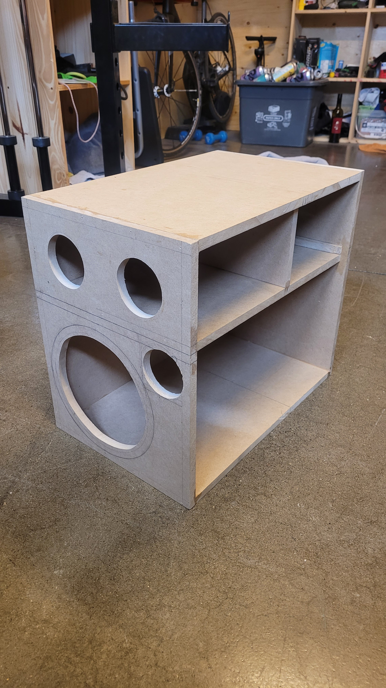
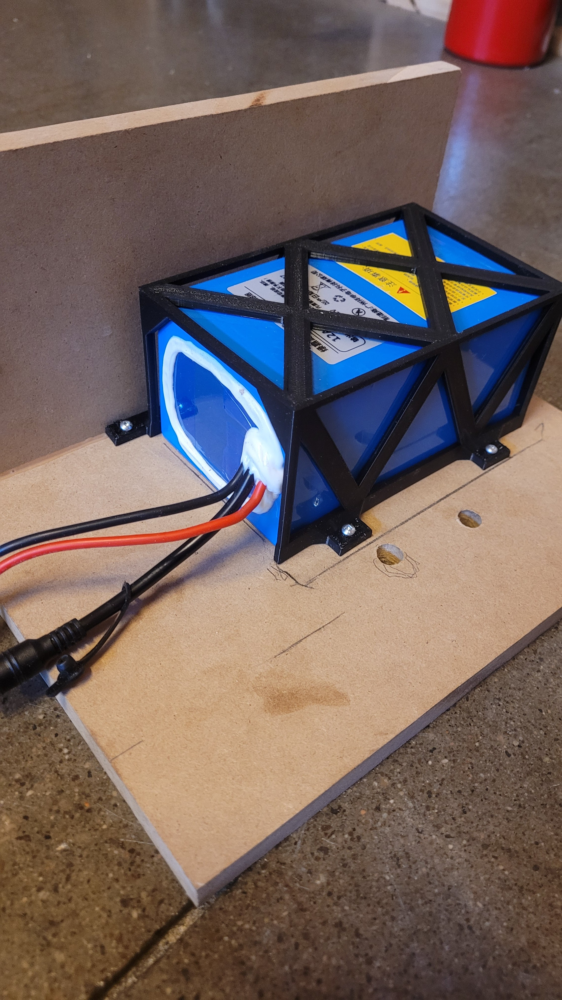
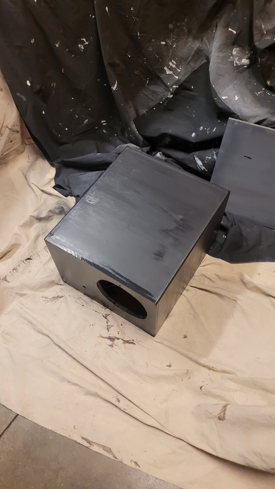
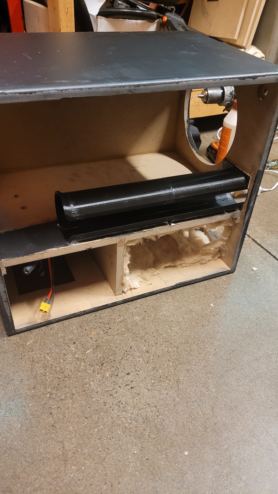
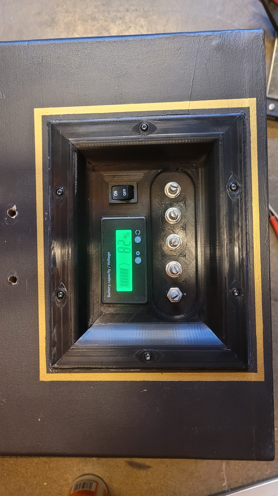
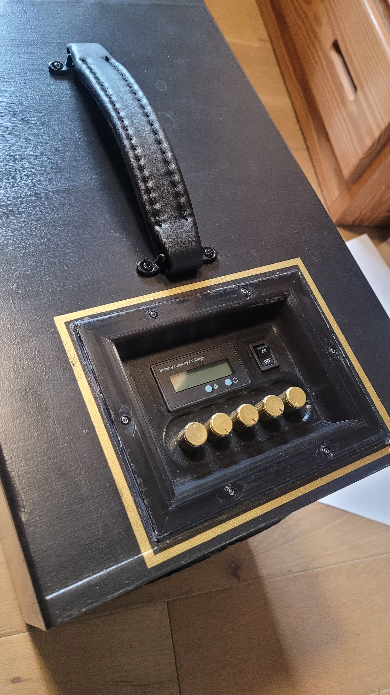
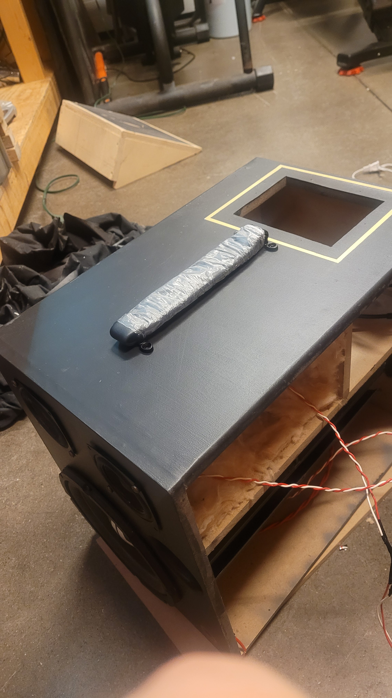
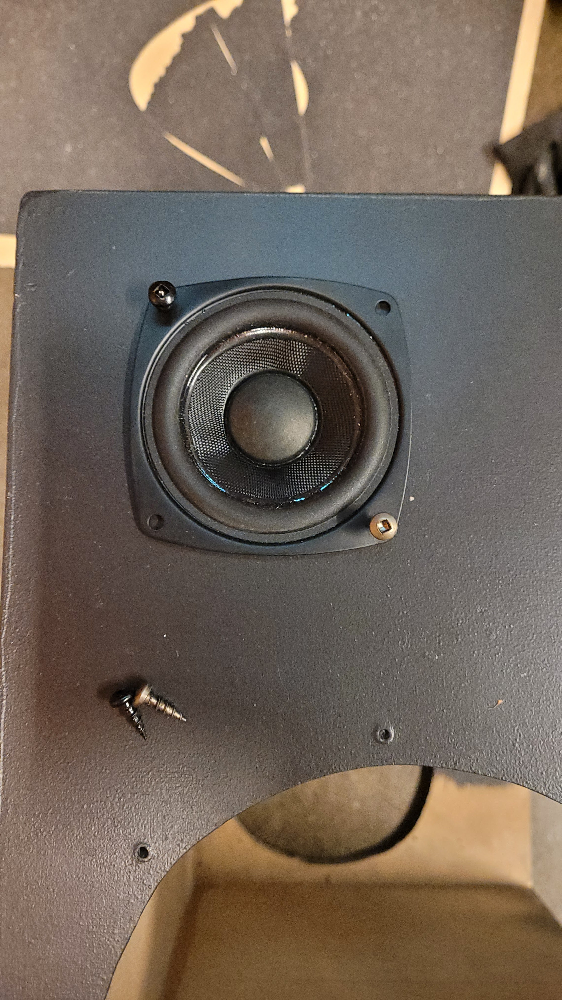
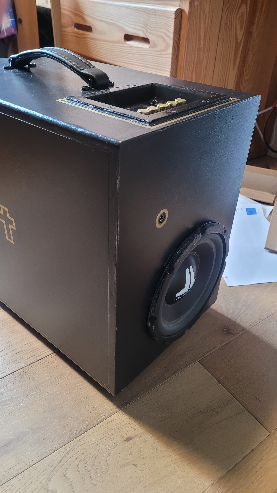
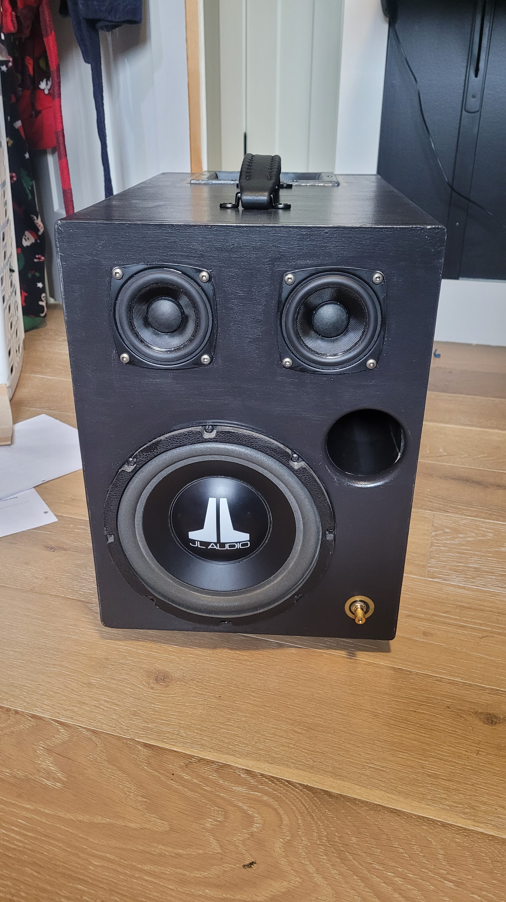

# Wireless Speaker 

*Date: December 2025 - March 2025* | Personal project during grade 12

---

A portable, wireless speaker that offers incredible battery life, high quality audio, as well as a whole heck of a lot of bass!

---

## Project Overview

**Objective:**  
Wanting to further increase my engineering skills, a speaker seemed like an easy project to start with. I wanted to create a speaker that I could bring around with me that sounded good and that had a lot of bass (as I enjoy listening to a lot of EDM music). Also as a high school student, I wanted to keep this somewhat budget friendly, especially after my [3D Printed Iron Man Suit](https://github.com/TheTronEngineer/Tron-Portfolio/tree/main/Projects/3D%20Printed%20Iron%20Man%20Suit)

This means the speaker had to be:
* Light enough to carry
* Big enough and have enough power to output a lot of sound
* Have a portable power source to be able to use it in different locations
* As cheap as I could get the parts
* Ideally somewhat stylish
* Durable enough to take it places

**Constraints:**  
A big limiting factor that was difficult for me at the beginning was knowledge. I hadn't really played with anything more than Arduinos before, so this was a lot different trying to mix different components with little to no documentation. 

---

## Engineering Process

**Design/Planning:**  
I started off with lots of reaserch. I watched plenty of Youtube videos on people building speakers, talking about nessisary components, and showing their build process. This really familiarized me with how speakers work and how to build them. From this, I determined I needed the following parts:  
* **Speaker driver**
* **Amplifier**
* **Cabinet (enclosure)**  
Along with a couple extras such as foam/insulation for the inside of the cabinets, and anthing else I wanted to decorate the speaker with or things that added funcitonality, like a handle

After this, came more reaserch. In order for everything to work, the power source needed to match with the amplifier, and the speaker drivers needed to match resistance with the amplifier and have a greater or equal power handling than the amplifier output. **So each part needed to be chosen carefully in order to have everything work properly.** One thing that helped with this was a free subwoofer from my uncle; I used this as a fixed component and planned the rest of the components from the sub

In the end, I decided on a **2.1 system** (right and left channel, and a subwoofer). This was driven by a fairly cheap bluetooth amplifier. The whole speaker was powered by a 24V 12Ah battery. The battery was chosen from some simple calculations coming from the max output of the amplifier

Along with the components, the speaker cabinet needed careful planning as well. Each speaker driver works differently in different sized cabinets, so **finding the optimal size for each would increase the volume and quality of the speaker.** I also learned a bit about ports, and how a certain length opening in a cabinet can help boost some low end sound. To find this optimal size, I used a software called **WinISD.** this gave me a volume for the sub and the two channel speakers and the length and size of the port I needed.

And finally, style! What would be the point of a speaker if it didn't look at lease a little cool? I had done a bunch of thinking and a little bit of sketching to help invision different designs. As seen in the picture below, I settled on a mostly rectangular design with some slightly rounded corners. I also did a basic model in Fusion 360 to get an idea on size and look of the speaker  
<table>
  <tr>
    <td></td>
    <td></td>
  </tr>
</table>

**Building/Iterating:**  
Now this was the fun part! After about 3 months of planning, simulating, calculating and designing, I was ready to build! I ordered the parts and had everything slowly arrive. As parts arrived, I started wiring the speaker drivers to the amplifier and a 12V power supply I had on hand to test the electronics. Thankfully, the speakers worked on the first try, with me being able to stream music over bluetooth, and adjust volume and a couple other parameters with the knobs on the amplifier. However the sound out of the drivers wasn't too loud because it was just playing in the open air  
<table>
  <tr>
    <td></td>
    <td></td>
    <td></td>
    <td></td>
  </tr>
</table>

After I had recieved all the electronics, I started to build the enclosure the the port for the speaker cabinet. I chose to use MDF as the cabinet material as it was a common choice online due to it's flat surfaces that would help reflect sound evenly inside the enclosure. I also put some insulation inside the left and right channel cabinet to help reduce resonant sound waves, creating a cleaner sound  
I 3D printed the port in the speaker. I was initially concerned about vibrations and resonant frequency within the print, but I made sure to print it with solid infil and out of PETG to help midigate those issues. Unfortunately due to the lack of space, I had to cut out some of the sides of the port so it would fit on the side of the speaker (as seen in the 4th image below)  
As a note, I did not include insulation in the subwoofer cabinet becuase the resonant sound waves are meant to travel out the port, giving it it's extended frequency range. It was also important to mount the battery with a custom printed cage to the electronics compartment so it wouldn't swing or bang around while in use  
<table>
  <tr>
    <td></td>
    <td></td>
    <td></td>
    <td></td>
  </tr>
</table>

One other fun part of this project is I got to design the control pannel for all the electronics. I modelled this in Fusion 360 by measuring components with calipers. I am very happy with how it looks, and it's held up really well over the years!
<table>
  <tr>
    <td></td>
    <td></td>
  </tr>
</table>

There were many other small 'mini-projects' that had to be completed for this project to come together as well, so here is where I'll yap about some of those.  
First, I'll talk about feet for the speaker. I didn't want the MDF cabinet to be flat on the floor, so I needed some rubber-like feet to raise it off the ground. I 3D modelled a foot that had a hole through the middle to be screwed in. I printed the feet out of TPU, (a fairly flexible filament, mimicking a rubber-like texture), and turned up the infill and wall count to give the feet enough strength to hold the weight of the speaker. These have worked incredibly and I have had no issues with them at all!  
The handle on the speaker is one I found off of amazon. It was listed as an amplifier handle, (so it was meant for a bit of weight), and it was matching my colour scheme for the speaker. To make sure the screws didn't come out, I added an additional small block of wood below the main cabinet of the speaker for the T-nuts to dig into and to help distribute the pressure over a wider area. This handle has since broken after lots of use, but I have found a similar, but renforced version That I replaced it with easily, and this new handle is working well.  
Painting! Probably the hardest part of this project just becuase I had to do so much waiting for dry time. I wanted this speaker to have a premium and stylish look so it was like a finished product that could be sold. I decided on going for a black with gold highlights style, due to the amplifier knob colours and the fact that I had leftover gold spraypaint from my previous [3D Printed Iron Man Suit](https://github.com/TheTronEngineer/Tron-Portfolio/tree/main/Projects/3D%20Printed%20Iron%20Man%20Suit). I ended up printing some stencils to help paint accurate and high quality designs to accent the points of interest on the speaker. These worked pretty well, but had a bit of fuzz on the outside of the design due to the stencils not sitting perfectly flat on the surface, but it's not a noticable issue. I also put clear coat on top of the paint for some protection. One final note that is related to colour schemes, is the screws that hold the speaker drivers to the cabinets. I would point out that these were intentionally chosen! (gold for the R and L drivers and black for the sub. Colours were also chosen based on availability in my Dad's screw collection).  
Another mini project was the 3D printed battery cage. this was very helpful in ensuring the battery wouldn't slide around during use (and cause many other problems...). I ended up designing a thin but sturdy cage that I printed and could screw down. This has worked wonderfully (despite my nervousness based on it's thinness), and has kept the battery in place well.  
One consideration that I had was making speaker grills to protect the drivers from damage. I modelled some grills to fit the speakers, but I ultimately decided to not go through with the grills for a couple reasons. First, printing the grills would be bulky and potentially block volume coming out of my speaker. Additionally, I didn't want to spend more money to purchase a better material for covers. So far, my speaker hasn't taken on any damage and it has been working well.
<table>
  <tr>
    <td></td>
    <td></td>
    <td></td>
    <td></td>
    <td></td>
  </tr>
</table>

Now there were some surprise additions to this project as I went along as well. My uncle I talked about a little while back? I visited him as I was building my speaker and i brought what I had (a mostly built cabinet with working electronics) to show him. His ADHD took over during the visit, so we flipped the speaker over, drilled a hole and added a second subwoofer to the speaker! Is this optimal? Probably not. Is it twice as awesome (and louder??), heck yea!! We ended up testing the sub both in series and in parallel. Series seemed to give more general volume and a smoother sound. Parrallel seemed to add a lot of extra punch to the bass. I chose to go in series as the subs were already fairly loud, so the punch was a little harsh sometimes  
Another addition I made quite a while later was some custom printed knobs. This was partially because the gold spray paint on the current knobs was coming off, but also because I realised that the controls were not intuitive whatsoever. this gave me a change to design small images that better depicted what each knob controlled (can you guess what each does?)  
<table>
  <tr>
    <td></td>
    <td></td>
  </tr>
</table>

I am super happy with how the speaker came out. It looks pretty professional, as well as sounding great with plenty of bass to go around  
<table>
  <tr>
    <td></td>
    <td></td>
  </tr>
</table>

**Testing and Validation:**  
Now especially because I was new to lots of this type of electronics and projects, I did lots of testing as I went through this project. The large amount of reaserch that I did for this project really helped me pick out the right parts for the speaker, but the tests were really the bits of motivation and verification that helped me remain confidant. These are the different landmark tests I did to ensure everything was working:  
* Tested the subwoofer with the amplifier and a 12V power supply I had on hand by plaing music from my phone over bluetooth
    * Although I didn't get a full speaker experience or much volume, I was very excited to see that I could play music from my phone on this sub!
* Tested the left and right channels with the amplifier and the 12V power supply by plaing music from my phone over bluetooth
    * This was slightly less exciting than the subwoofer, but this helped me know that I had picked good drivers to pair with the sub
* After I had wired the circuit with the switch and battery display, I tested the speaker drivers once again to ensure the speaker could run off of the battery
    * I was quite nervous doing this test, especially as a 24V 12Ah battery is no joke. I took many precautions and safties to ensure the terminals wouldn't cross or short
* Tested the speaker all assembled, minus one side panel (I still had some work to do inside before sealing)
    * I did this at my uncles when we added the second subwoofer, which also came with it's testing. This was probably the happiest I had been the entire project. Now being able to nearly close the cabinat, I could hear that the enclosure really does make the speaker much louder, and got me really excited about the end product
* Finally, I tested it before I sealed everything up, ensuring my wiring wouldn't break and I wouldn't need to access the inside again
    * After sealing it, I was free to finish any painting and play it to my hearts content!

---

## Reflection

**Achievements and Accomplishments:**  
* I believe I fufilled the goals of this project very well.
    * The speaker had high audio quality with lots of low end, was battery powered and had a carrying handle for portability, and probably spent around $300 (which is great for this quality and caliber of speaker!)
* I was very happy with the projects success.
    * This project was of a higher level where I was able to learn and apply knowledge to move outside the realm of arduino based projects, and into component selection and open-ended circuit design
* Overall I loved using the speaker!

**Future Improvements:**  
* One Problem that I ended up fixing was the controls on the speaker.
    * The amplifier has 5 knobs, each with a different function. And with the front plate of the amlifier covered, there was no indication of what each control does.
    * I did print some of my own knobs with picture diagrams on the top, so this helps, however it still isn't perfect
* Another issue that I've been worried about is it's waterproof capabilities.
    * The speaker cabinet itself is waterproof, but the control panel (especially being 3D printed), the handle, charging port and really any other component that disrupts the enclosure might not be waterproof, which makes me nervous keeping it out in rainy conditions
    * In the future I would want to look into beter design for the components to direct water away, (like how the brim of a hat blocks sunlight and rain from your face). I would also look into different materials other than 3D printing, as well as hardware like rubber gaskets that would resist water leaking through
* The absolutely massive battery...
    * Initially doing calculations, I calculated the battery life assuming constant maximum output from the amplifier. Now after some use, I have learned that playing music quieter than max volume, or even the music itself having quieter moments or micro breaks that don't use as much power, really reduces the draw the speaker has on battery life. This means that I have an incredibly oversized batter for this speaker (probably 10 charges since I've made it, and this is with heavy use)
    * In the future, I would downsize the battery to a more appropriate size, (even 6AH would be plenty), so that the speaker is lighter and easier to carry
* Portability
    * The final item that is tricky with this design, (especially with the massive battery and subs), is that it is pretty heavy and burdensome to carry. I believe it weighs ~15-20lbs.
    * Reducing the battery size would greatly help reduce the weight so it is nicer to carry. Additionally, I might look into some sort of wheels so it can be rolled around rather than carried

---

## Author

Aiden Nickel 
Mechatronic Systems Engineer | Western University

[LinkedIn](www.linkedin.com/in/aiden-nickel) | nickelaiden@gmail.com
