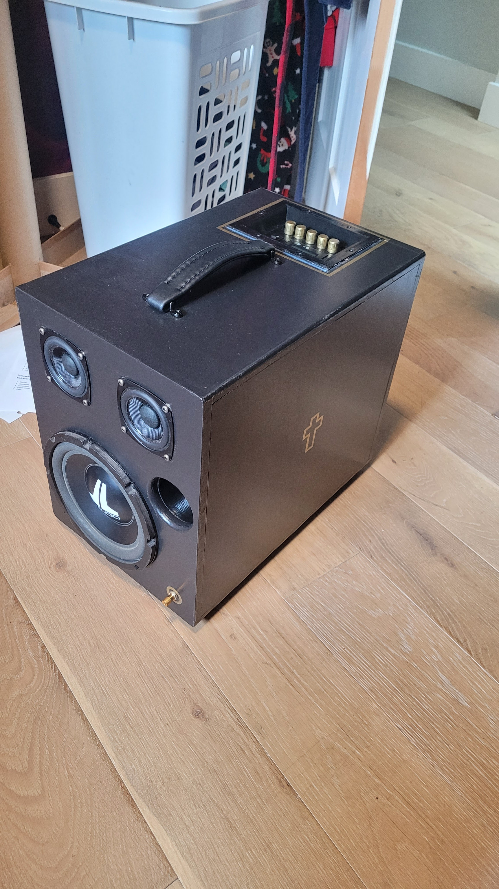
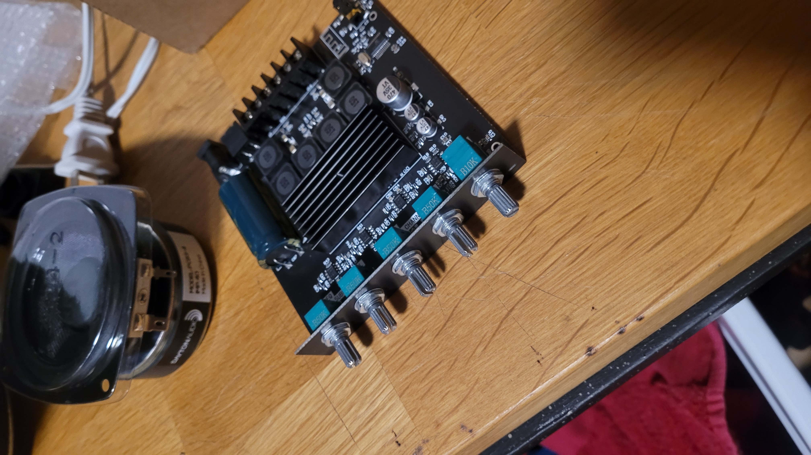
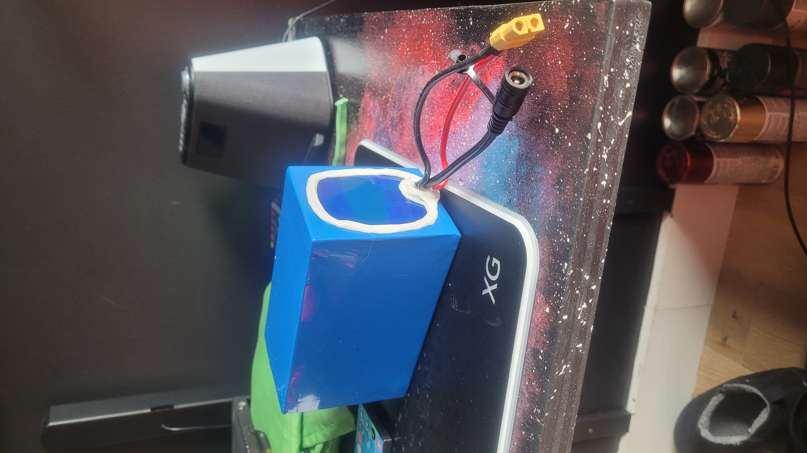

# Wireless Speaker 

*Date: December 2025 - March 2025* | Personal project during grade 12

---

A portable, wireless speaker that offers incredible battery life, high quality audio, as well as a whole heck of a lot of bass!

---

## Project Overview

**Objective:**  
Wanting to further increase my engineering skills, a speaker seemed like an easy project to start with. I wanted to create a speaker that I could bring around with me that sounded good and that had a lot of bass (as I enjoy listening to a lot of EDM music). Also as a high school student, I wanted to keep this somewhat budget friendly, especially after my [3D Printed Iron Man Suit](https://github.com/TheTronEngineer/Tron-Portfolio/tree/main/Projects/3D%20Printed%20Iron%20Man%20Suit)

This means the speaker had to be:
* Light enough to carry
* Big enough and have enough power to output a lot of sound
* Have a portable power source to be able to use it in different locations
* As cheap as I could get the parts
* Ideally somewhat stylish
* Durable enough to take it places

**Constraints:**  
A big limiting factor that was difficult for me at the beginning was knowledge. I hadn't really played with anything more than Arduinos before, so this was a lot different trying to mix different components with little to no documentation. 

---

## Engineering Process

**Design/Planning:**  
I started off with lots of reaserch. I watched plenty of Youtube videos on people building speakers, talking about nessisary components, and showing their build process. This really familiarized me with how speakers work and how to build them. From this, I determined I needed the following parts:  
* **Speaker driver**
* **Amplifier**
* **Cabinet (enclosure)**  
Along with a couple extras such as foam/insulation for the inside of the cabinets, and anthing else I wanted to decorate the speaker with or things that added funcitonality, like a handle

After this, came more reaserch. In order for everything to work, the power source needed to match with the amplifier, and the speaker drivers needed to match resistance with the amplifier and have a greater or equal power handling than the amplifier output. **So each part needed to be chosen carefully in order to have everything work properly.** One thing that helped with this was a free subwoofer from my uncle; I used this as a fixed component and planned the rest of the components from the sub

In the end, I decided on a **2.1 system** (right and left channel, and a subwoofer). This was driven by a fairly cheap bluetooth amplifier. The whole speaker was powered by a 24V 8Ah (not exactly sure on the capacity now) battery. The battery was chosen from some simple calculations coming from the max output of the amplifier

Along with the components, the speaker cabinet needed careful planning as well. Each speaker driver works differently in different sized cabinets, so **finding the optimal size for each would increase the volume and quality of the speaker.** I also learned a bit about ports, and how a certain length opening in a cabinet can help boost some low end sound. To find this optimal size, I used a software called **WinISD.** this gave me a volume for the sub and the two channel speakers and the length and size of the port I needed.

And finally, style! What would be the point of a speaker if it didn't look at lease a little cool? I had done a bunch of thinking and a little bit of sketching to help invision different designs. As seen in the picture below, I settled on a mostly rectangular design with some slightly rounded corners. I also did a basic model in Fusion 360 to get an idea on size and look of the speaker  
<table>
  <tr>
    <td></td>
    <td></td>
  </tr>
</table>

**Building/Iterating:**  
Now this was the fun part! After about 3 months of planning, simulating, calculating and designing, I was ready to build! I ordered the parts and had everything slowly arrive. As parts arrived, I started wiring the speaker direvers to the amplifier and a 12V power supply I had on hand to test the electronics. Thankfully, the speakers worked on the first try, with me being able to stream music over bluetooth and adjust volume and a couple other parameters with the knobs on the amplifier. However the sound out of the drivers wasn't too loud because it was just playing in the open air  
<table>
  <tr>
    <td></td>
    <td></td>
    <td></td>
    <td></td>
  </tr>
</table>

After I had recieved all the electronics, I started to build the enclosure the the port for the speaker cabinet. I chose to use MDF as the cabinet material as it was a common choice online due to it's flat surfaces that would help reflect sound evenly inside the enclosure. I also 3D printed the port

**Testing:**  
After/during the project, how did you make sure items were working as intended? How did you measure success?

---

## Reflection

**Achievements and Accomplishments:**  
What did you like about the project, what went well, what did you learn?

**Future Improvements:**  
What would you change for next time, what didn't go super well, what did you learn?

---

## Author

Aiden Nickel 
Mechatronic Systems Engineer | Western University

[LinkedIn](www.linkedin.com/in/aiden-nickel) | nickelaiden@gmail.com
