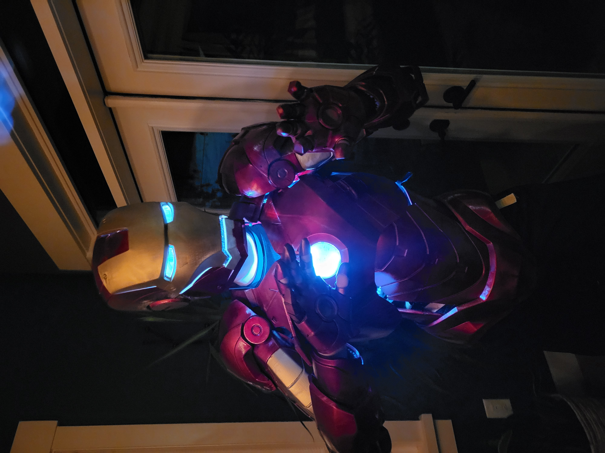

# Aiden Nickel – Engineering Portfolio

**Mechatronic Systems Engineering Student | 3rd year Western University**
<table>
  <tr>
    <td></td>
    <td></td>
  </tr>
</table>

Hi, my name is Aiden Nickel, and I want to welcome to my engineering portfolio! This here is a collection of all the projects I have worked on over the years, as well as some certificates and letters of reccomendations.
I am a hard working engineer that is not afraid to get my hands dirty or dig into something I'm new to. In fact, I love learning how things work and new things everyday, right from when I was a child! (For real though, you can ask my parents). I always try to keep a positive attitude, and I love encouraging teammates and friends in whatever I can. I do my best to communicate clearly and quickly, and I am not afraid to take on individual or group projects.

---

## Portfolio Navigation

This repository is organized into the following sections:

### Projects
Engineering and programming projects demonstrating technical skills. These are both personal projects as well as projects from University and High School. This includes documentation and explination of many of the projects I have worked on over the years. The biggest projects/the ones I am most proud of will have their own folders on display here. Many of the other projects I've done wil be organized into sub-folders to help keep this somewhat organized lol

See:  
`/Projects`

---

### Certificates
Professional certifications and technical training. These are awards or certifications I've gathered through the years, ranging from Excel to WHIMIS, all the way to SolidWorks

See:  
`/Certificates`

---

### Letters of Reccomendation
This is fairly self-explanitory, but this includes letters of reccomendation that I have recieved from numerous employers as well as mentors and friends for scholarships, jobs and more! These attest to my character, work ethic and my ability to work anywhere I am placed

See:  
`/Letters of Reccomendation`

---

### In Progress
Proceed if you dare! Just kidding, there's nothing dangerous there. Because I have more ideas for projects that I could ever have time for, I will always be slowly adding to this portfolio when I have time. You might find some pretty awesome stuff here, but it is also most likely not fully filled out, ready, or maybe the project is still in progress!

See:  
`/In Progress`

---

## Contact

**Aiden Nickel**
Feel free to reach out and say hi! I'd be more than happy to talk about any of my projects, certificatons or letters of reccomendations!

[LinkedIn](www.linkedin.com/in/aiden-nickel) 

Email: nickelaiden@gmail.com
